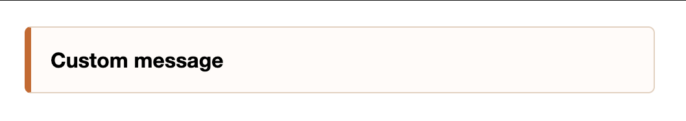

# Easy-Toast

> built for project that i use vanilla Javascript or typescript that I do not want to use extra libraries with it

### how to use

> showToast(message, position, type)

1. Message: string
2. position: string
   1. top
   2. bottom
   3. left
   4. right
   5. top left
   6. top right
   7. bottom left
   8. bottom right
3. type: string
   1. success
   2. warning
   3. error

|            Error/Warning             |             Success              |
| :----------------------------------: | :------------------------------: |
|  |  |

### TODO

- [x] Show Toast
- [x] Select place to show toast
- [ ] Show stack of toasts
- [ ] Show timer under post
- [ ] Add SVG logos depend on user request
- [ ] OnClick close toast
